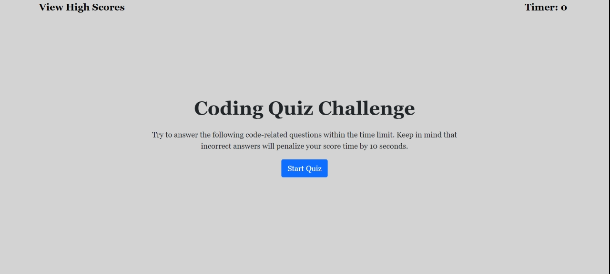

<<<<<<< HEAD
# TIMED QUIZ
## Project Description

This is a quiz with multiple-choice questions that will be timed. You will have 120 seconds to answer 4 questions. Each question will have only one right answer. The object is to have a lot of time left when you complete the quiz. If you do not answer a question correctly, you will be deducted 10 seconds off the clock. When all of your questions are answered or the timer reaches zero the game is over. You will then add your initials and your score will be saved. 
## Installation

1. Download or clone repository
2. Open the main page (index.html) on your browser to view webpage
3. Use a text editor to view all coding, Visual Studio Coding is recommended.
## User Story

GIVEN I am taking a code quiz
WHEN I click the start button
THEN a timer starts and I am presented with a question
WHEN I answer a question
THEN I am presented with another question
WHEN I answer a question incorrectly
THEN time is subtracted from the clock
WHEN all questions are answered or the timer reaches 0
THEN the game is over
WHEN the game is over
THEN I can save my initials and score
## Acceptance Criteria

This app will run in the browser and feature dynamically updated HTML and CSS powered by Javascript. Here are the steps that a user will experience: 

1. The user will see a page with a start button.
2. As soon as the button is clicked, a timer will start.
3. The user will be presented with a question.
4. After answering that question, the user will be presented with 3 additional questions.
5. If a question is answered incorrectly, time will be subtracted from the clock.
6. When all of the questions are answered or the timer reaches zero, the game is over. 
7. When the game is over, you will be presented with a screen that will show your score. 
8. You will add your initials, and play again if you want to or clear everything out. 
## Mock-Up

## Technologies Used 

- HTML
- CSS
- BOOTSTRAP
- JAVASCRIPT 

## Project link

GITHUB: https://github.com/TammyGagliano/timed-quiz
DEPLOYED: 
=======
# timed-quiz

This is a quiz with multiple-choice questions that will be timed. You will have 120 seconds to answer 4 questions. Each question will have only one right answer. The object is to have a lot of time left when you complete the quiz. If you do not answer a question correctly, you will be deducted 10 seconds off the clock.

This app will run in the browser and feature dynamically updated HTML and CSS powered by Javascript. Here are the steps that a user will experience: 

1. The user will see a page with a start button.
2. As soon as the button is clicked, a timer will start.
3. The user will be presented with a question.
4. After answering that question, the user will be presented with 3 additional questions.
5. If a question is answered incorrectly, time will be subtracted from the clock.
6. When all of the questions are answered or the timer reaches zero, the game is over. 
7. When the game is over, you will be presented with a screen that will show your score. 
8. You will add your initials, and play again if you want to or clear everything out. 
>>>>>>> 88228cb750cb5b12e7a5c45f943f35c4eb479e7c
